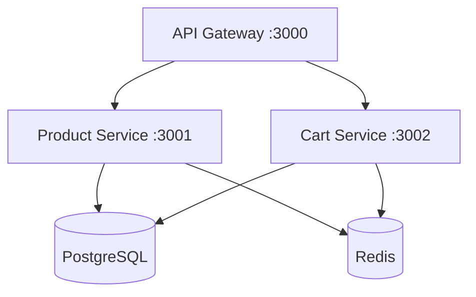

# Shopping Cart Backend

Enterprise-grade NestJS microservices architecture featuring PostgreSQL persistence, Redis caching, and an API Gateway.

## 🏗 Architecture



## 🚀 Quick Start

### Prerequisites
- **Node.js**: 18+
- **PostgreSQL**: 15+
- **Redis**: 7+ (Docker recommended)

### 1. Database Setup
Create the main database:
```sql
CREATE DATABASE shopping_cart_db;
```

### 2. Environment Configuration
Copy the `.env` template in each service folder (`gateway`, `product-service`, `cart-service`) and update your credentials.

### 3. Installation & Execution
```bash
# Install all dependencies
npm install --prefix gateway
npm install --prefix product-service
npm install --prefix cart-service

# Start services (run in separate terminals)
npm run start:dev --prefix product-service
npm run start:dev --prefix cart-service
npm run start:dev --prefix gateway
```

## 🔌 API Endpoints (Gateway :3000)

| Service | Method | Path | Description |
| :--- | :--- | :--- | :--- |
| **Auth** | POST | `/auth/signup` | Register new user |
| **Auth** | POST | `/auth/login` | Authenticate user |
| **Product**| GET | `/products` | List all products (Cached) |
| **Cart** | GET | `/cart` | Get current user's cart |
| **Cart** | POST | `/cart` | Add product to cart |
| **Cart** | DELETE | `/cart/:id` | Remove item from cart |
| **Cart** | DELETE | `/cart` | Clear entire cart |

## 🧪 Testing

Run backend unit tests:
```bash
cd product-service && npm test
```

## 🛠 Tech Stack
- **Framework**: [NestJS](https://nestjs.com/)
- **ORM**: TypeORM
- **Cache**: Redis
- **Security**: JWT, Passport, Helmet, CORS
- **Validation**: class-validator

---
